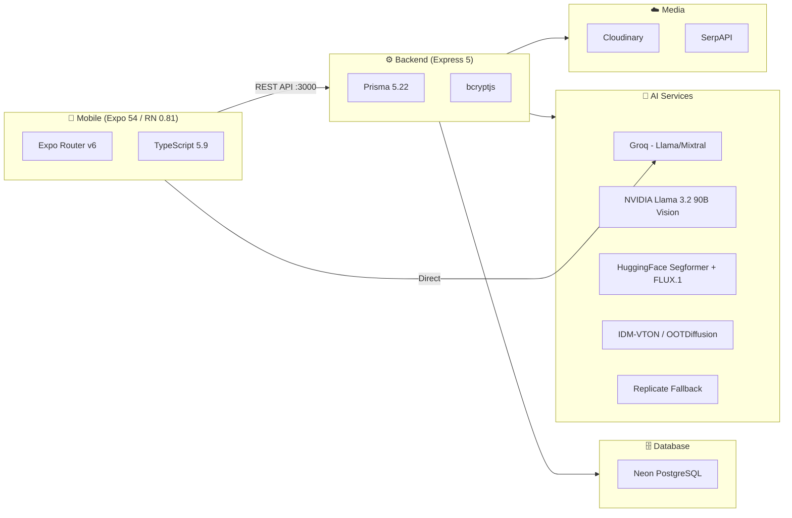
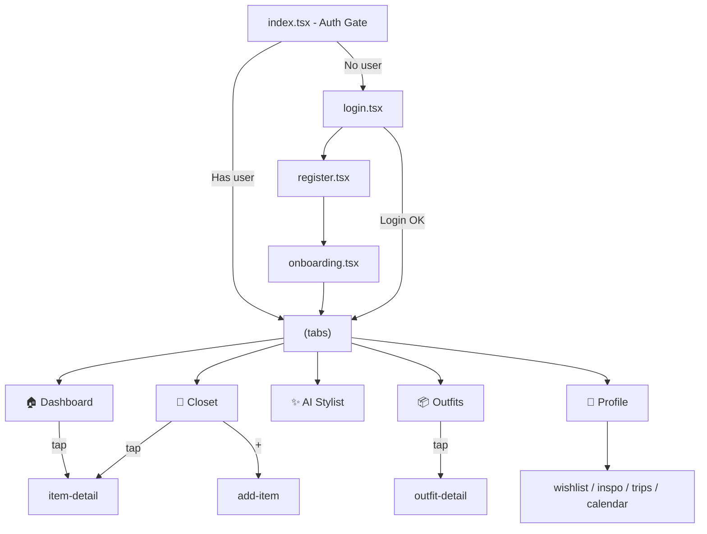

# Atlas (Fashion X) — Full Project Context

> **Brand**: Fashion X (formerly "Atla Daily")  
> **Version**: 1.2.0  
> **Design**: Minimalist Luxury, Black/White Mono, Scandinavian

---

## 🏗️ Architecture



---

## 📁 File Tree

```
atlas/
├── mobile/                          # React Native (Expo 54)
│   ├── app/
│   │   ├── _layout.tsx              # Root Stack + AuthProvider
│   │   ├── index.tsx                # Auth gate → login or tabs
│   │   ├── login.tsx                # Email + password login
│   │   ├── register.tsx             # Registration
│   │   ├── onboarding.tsx           # Multi-step onboarding wizard
│   │   ├── add-item.tsx             # Add clothing (camera/gallery + AI extract)
│   │   ├── item-detail.tsx          # Item detail (modal)
│   │   ├── outfit-detail.tsx        # Outfit detail (modal)
│   │   ├── search.tsx               # Full-screen search
│   │   ├── wishlist.tsx             # Wishlist (mock data)
│   │   ├── inspo.tsx                # Inspo moodboard (mock data)
│   │   ├── trip-planner.tsx         # Trip packing (mock data)
│   │   ├── calendar-log.tsx         # Wear history (mock data)
│   │   └── (tabs)/
│   │       ├── _layout.tsx          # Bottom tab bar (5 tabs)
│   │       ├── index.tsx            # Dashboard — discovery feed
│   │       ├── closet.tsx           # My Closet — user items
│   │       ├── ai-stylist.tsx       # AI Stylist — chat + outfit cards
│   │       ├── outfits.tsx          # Outfits — collection + planner
│   │       └── profile.tsx          # Profile — stats, avatar, settings
│   ├── components/
│   │   └── GradientButton.tsx
│   ├── constants/
│   │   ├── theme.ts                 # Design tokens (Colors, Shadows, etc.)
│   │   └── data.ts                  # Mock data + TypeScript interfaces
│   ├── services/
│   │   ├── ai.ts                    # Groq AI (5-model fallback)
│   │   └── weather.ts               # OpenWeather API
│   └── src/
│       ├── contexts/AuthContext.tsx  # Auth state (useReducer)
│       └── services/api.ts          # Typed REST client
│
├── backend/                         # Express 5 + Prisma
│   ├── index.ts                     # MONOLITH (1188 lines, all routes)
│   ├── prisma/schema.prisma         # 5 models
│   └── src/
│       ├── controllers/fashionController.ts
│       ├── routes/fashion.ts
│       └── services/serpApiService.ts
│
├── docs/                            # Engineering docs
└── context.md                       # ← THIS FILE
```

---

## 🗄️ Database Schema

```prisma
model User {
  id, name, email (unique), password?, style, preferredBrands[],
  occupation?, wearPreference?, hearSource?, streak, level, avatar?
  → ClothingItem[], Outfit[]
}

model ClothingItem {
  id, name, category, color, brand, imageUrl, tags[],
  wearCount, favorite, lastWorn?
  → User, → OutfitItem[]
}

model Outfit {
  id, name, occasion, rating, aiGenerated, weather?, imageUrl?, date
  → User, → OutfitItem[]
}

model OutfitItem {  // Many-to-many join
  outfitId + clothingItemId (unique pair)
}

model CachedProduct {
  id, title, brand, price, thumbnail, link, source, query, category?
  @@index([query]), @@index([category])
}
```

---

## 🔌 API Endpoints (20+)

### Auth
| Method | Path | Description |
|--------|------|-------------|
| POST | `/api/register` | Register (bcrypt hash) |
| POST | `/api/login` | Login (bcrypt compare) |

### Wardrobe
| Method | Path | Description |
|--------|------|-------------|
| GET | `/api/clothes/:userId` | All user items |
| GET | `/api/clothes/item/:id` | Single item |
| POST | `/api/clothes` | Add item |
| PATCH | `/api/clothes/:id` | Update (fav, wearCount) |
| DELETE | `/api/clothes/:id` | Delete item |
| POST | `/api/clothes/extract` | **AI Extraction Pipeline** |
| POST | `/api/clothes/flatlay` | Legacy upload |

### Outfits
| Method | Path | Description |
|--------|------|-------------|
| GET | `/api/outfits/:userId` | All outfits (with items) |
| POST | `/api/outfits` | Save outfit |
| POST | `/api/outfit/search-items` | **Smart Search Pipeline v2** |

### User
| Method | Path | Description |
|--------|------|-------------|
| GET | `/api/user/:userId/stats` | Stats |
| PUT | `/api/user/:id/avatar` | Update avatar |
| PUT | `/api/user/:id/brands` | Update brands |
| PUT | `/api/user/:id/onboarding` | Save onboarding |

### AI
| Method | Path | Description |
|--------|------|-------------|
| POST | `/api/try-on` | Virtual Try-On pipeline |
| POST | `/api/generate-avatar` | AI avatar (FLUX.1) |

### Fashion Discovery
| Method | Path | Description |
|--------|------|-------------|
| GET | `/api/fashion/search?q=` | Search products |
| GET | `/api/fashion/feed/:userId` | Personalized feed |
| GET | `/api/fashion/item/:id` | Cached product detail |

---

## 🤖 AI Pipelines

### Pipeline 1: AI Stylist (Mobile → Groq)
```
User prompt → Groq API (5-model fallback):
  llama-3.1-8b → mixtral-8x7b → gemma2-9b → llama3-8b → llama-3.3-70b
Output: 3 outfits × 4 items (top, bottom, footwear, accessory)
  → Each item → Smart Search Pipeline
```

### Pipeline 2: Smart Search v2 (Backend)
```
L1: User's Closet (exact ID → fuzzy category+color)
L2: CachedProduct DB (exact query → keyword → category)
L3: Live SerpAPI (Google Shopping → cache results)
L4: Type Fallback (generic keyword in cache)
```

### Pipeline 3: AI Wardrobe Extraction (Backend)
```
Upload photo →
  1. HF segformer_b2_clothes (segmentation)
  2. Sharp (mask compositing, crop, noise reject)
  3. NVIDIA Vision (STRAIGHT vs CRUMPLED decision)
     → STRAIGHT: Sharp polish
     → CRUMPLED: NVIDIA describes → FLUX.1 regenerates flat-lay
  4. Cloudinary upload
  5. Groq Vision AI tagging (name, category, color, brand)
```

### Pipeline 4: Virtual Try-On (Backend)
```
Avatar + Garment →
  Upper body → yisol/IDM-VTON (HF Gradio)
  Lower body → levihsu/OOTDiffusion (HF Gradio)
  Fallback → cuuupid/idm-vton (Replicate)
  → Cloudinary upload
```

---

## 📱 Screen Wireframes

### Navigation Flow


### Tab 1: Dashboard (index.tsx)
```
┌─────────────────────────────┐
│      F A S H I O N  X       │
│        WARDROBE OS          │
├─────────────────────────────┤
│ ┌─────────────────────────┐ │
│ │ 🔍 Search brands...     │ │
│ └─────────────────────────┘ │
│                             │
│ ┌─────────────────────────┐ │
│ │  ┌───────────────────┐  │ │
│ │  │   HERO BANNER     │  │ │
│ │  │   ┌─────────┐     │  │ │
│ │  │   │TRENDING │     │  │ │
│ │  │   │NOW      │VIEW │  │ │
│ │  │   └─────────┘     │  │ │
│ │  └───────────────────┘  │ │
│ └─────────────────────────┘ │
│                             │
│ DISCOVER    14 CURATED      │
│ ┌──────┐  ┌──────┐         │
│ │      │  │      │         │
│ │ img  │  │ img  │         │
│ │      │  │      │  Pinterest
│ │      │  │      │  Masonry │
│ ├──────┤  ├──────┤  Grid    │
│ │ NAME │  │ NAME │         │
│ │ Brand│  │ Brand│         │
│ └──────┘  └──────┘         │
│ ┌──────┐  ┌──────┐         │
│ │      │  │      │         │
│ │ img  │  │ img  │         │
│ │      │  │      │         │
│ └──────┘  └──────┘         │
│                        ┌──┐│
│                        │+ ││ ← FAB
│                        └──┘│
├─────────────────────────────┤
│ 🏠    👕    ✨    📦    👤  │
└─────────────────────────────┘
```

### Tab 2: Closet (closet.tsx)
```
┌─────────────────────────────┐
│ MY CLOSET              [+]  │
├─────────────────────────────┤
│ ┌─────────────────────────┐ │
│ │ 🔍 Search items...      │ │
│ └─────────────────────────┘ │
│                             │
│ ┌────┐┌────┐┌────┐┌────┐   │
│ │ALL ││TOPS││BTTM││SHOE│...│ ← Category chips
│ └────┘└────┘└────┘└────┘   │
│                             │
│ ALL PIECES              8   │
│ ┌──────┐  ┌──────┐         │
│ │      │  │      │         │
│ │ img  │  │ img  │ ♥       │
│ │      │  │      │         │
│ ├──────┤  ├──────┤         │
│ │ NAME │  │ NAME │         │
│ │ Brand│  │ Brand│         │
│ └──────┘  └──────┘         │
│ ┌──────┐  ┌──────┐         │
│ │      │  │      │         │
│ │ img  │  │ img  │         │
│ └──────┘  └──────┘         │
├─────────────────────────────┤
│ 🏠    👕    ✨    📦    👤  │
└─────────────────────────────┘
```

### Tab 3: AI Stylist (ai-stylist.tsx)
```
┌─────────────────────────────┐
│ [←]    ☀️ 32° H:33 L:26 [⏰]│
├─────────────────────────────┤
│                             │
│    FASHION X AI STYLIST     │
│  Personalized styling from  │
│        your closet          │
│                             │
│ ┌─────────────────────────┐ │
│ │ ⛅ What should I wear   →│ │
│ │    for a rainy day?      │ │
│ └─────────────────────────┘ │
│ ┌─────────────────────────┐ │
│ │ 🍽 I have a dinner      →│ │
│ │    date tonight          │ │
│ └─────────────────────────┘ │
│ ┌─────────────────────────┐ │
│ │ ☕ Minimalist look for  →│ │
│ │    a brunch meet         │ │
│ └─────────────────────────┘ │
│                             │
│  After sending a message:   │
│ ┌─────────────────────────┐ │
│ │ OUTFIT NAME              │ │
│ │ occasion                 │ │
│ │ ┌─────┐ ┌─────┐         │ │
│ │ │ TOP │ │BOTTM│  Masonry │ │
│ │ │     │ │     │  4-item  │ │
│ │ ├─────┤ ├─────┤  Grid    │ │
│ │ │SHOES│ │ ACC │         │ │
│ │ │     │ │     │         │ │
│ │ └─────┘ └─────┘         │ │
│ │ TOP · BOTTOM · SHOE · AC│ │
│ │ "Styling advice text..." │ │
│ │ ♡  ✏️  👎  📤  [Avatar] │ │
│ └─────────────────────────┘ │
│                             │
├─────────────────────────────┤
│ 📷 👕 │ Ask anything...  [↑]│
└─────────────────────────────┘
  Tab bar hidden on this screen
```

### Tab 4: Outfits (outfits.tsx)
```
┌─────────────────────────────┐
│ WARDROBE        [✨AI STYLIST]│
│ Curated Looks               │
├─────────────────────────────┤
│ ┌───────────┬──────────────┐│
│ │COLLECTION │   PLANNER    ││ ← Segment tabs
│ └───────────┴──────────────┘│
│                             │
│ ┌────┐┌────┐┌────┐┌────┐   │
│ │ALL ││WORK││CASU││EVE │...│
│ └────┘└────┘└────┘└────┘   │
│                             │
│ ALL LOOKS               4   │
│ ┌──────┐  ┌──────┐         │
│ │┌──┬──┐│  │      │         │
│ ││  │  ││  │ img  │  AI     │
│ │├──┼──┤│  │      │  badge  │
│ ││  │  ││  │      │         │
│ │└──┴──┘│  └──────┘         │
│ │ NAME  │  │ NAME  │        │
│ │ Occ ⭐│  │ Occ ⭐│        │
│ └──────┘  └──────┘         │
│                             │
│ ═══ PLANNER TAB ═══        │
│ ┌─────────────────────────┐ │
│ │ WEEKLY SCHEDULE          │ │
│ │┌───┐ ┌─────────────────┐│ │
│ ││MON│ │[img][img] NAME  ││ │
│ │└───┘ └─────────────────┘│ │
│ │┌───┐ ┌─────────────────┐│ │
│ ││TUE│ │[img][img] NAME  ││ │  ← TODAY badge
│ │└───┘ └─────────────────┘│ │
│ └─────────────────────────┘ │
├─────────────────────────────┤
│ 🏠    👕    ✨    📦    👤  │
└─────────────────────────────┘
```

### Tab 5: Profile (profile.tsx)
```
┌─────────────────────────────┐
│ Profile                  ⚙️  │
├─────────────────────────────┤
│                             │
│          ┌─────┐            │
│          │     │            │
│          │ AVA │            │
│          │     │            │
│          └─────┘            │
│         User Name           │
│    Style Explorer • 14 Day  │
│                             │
│   ┌─────┬─────┬─────┐      │
│   │  8  │  4  │  3  │      │
│   │PIECE│OUTFT│ FAV │      │
│   └─────┴─────┴─────┘      │
│                             │
│ ┌─────────────────────────┐ │
│ │ Digital Try-On Avatar   │ │
│ │ Upload or generate AI   │ │
│ │ ┌────────┐┌────────┐    │ │ ← Black card
│ │ │ UPDATE ││GENERATE│    │ │
│ │ └────────┘└────────┘    │ │
│ └─────────────────────────┘ │
│                             │
│ EXPLORE                     │
│ ┌─────────────────────────┐ │
│ │ ♡ Wishlist            → │ │
│ │ 🖼 Inspo Feed         → │ │
│ │ ✈️ Trips              → │ │
│ │ 📅 History            → │ │
│ └─────────────────────────┘ │
│ PREFERENCES                 │
│ ┌─────────────────────────┐ │
│ │ 🔔 Daily Reminders  [●]│ │
│ │ ☀️ Weather Insights  [●]│ │
│ └─────────────────────────┘ │
│ ┌─────────────────────────┐ │
│ │ 🚪 Sign Out             │ │
│ └─────────────────────────┘ │
│    FASHION X · v1.0.0       │
├─────────────────────────────┤
│ 🏠    👕    ✨    📦    👤  │
└─────────────────────────────┘
```

### Modal: Add Item (add-item.tsx)
```
┌─────────────────────────────┐
│ [×]    ADD TO CLOSET        │
├─────────────────────────────┤
│                             │
│ ┌─────────────────────────┐ │
│ │                         │ │
│ │     📷 TAP TO SELECT    │ │
│ │        YOUR PHOTO       │ │
│ │                         │ │
│ │  [CAMERA]  [GALLERY]    │ │
│ └─────────────────────────┘ │
│                             │
│ After photo selected:       │
│ ┌─────────────────────────┐ │
│ │ [AI EXTRACT]            │ │ ← Calls /api/clothes/extract
│ └─────────────────────────┘ │
│                             │
│ Extracted items appear:     │
│ ┌───┐ ┌───┐                │
│ │TOP│ │BTM│  ← AI-segmented│
│ └───┘ └───┘    items       │
│                             │
│ Name:  [AI-tagged name   ]  │
│ Cat:   [AI-tagged cat    ]  │
│ Color: [AI-tagged color  ]  │
│ Brand: [AI-tagged brand  ]  │
│                             │
│ ┌─────────────────────────┐ │
│ │    SAVE TO CLOSET       │ │
│ └─────────────────────────┘ │
└─────────────────────────────┘
```

### Modal: Item Detail (item-detail.tsx)
```
┌─────────────────────────────┐
│ [←]                    [♡]  │
├─────────────────────────────┤
│ ┌─────────────────────────┐ │
│ │                         │ │
│ │      ITEM IMAGE         │ │
│ │      (full width)       │ │
│ │                         │ │
│ └─────────────────────────┘ │
│                             │
│ ITEM NAME                   │
│ Brand • Category            │
│ Color: Navy Blue            │
│                             │
│ Tags: [casual] [summer]     │
│                             │
│ Worn: 24 times              │
│ Last: May 4, 2026           │
│                             │
│ ┌────────┐ ┌────────┐      │
│ │TRY ON  │ │ DELETE │      │
│ └────────┘ └────────┘      │
└─────────────────────────────┘
```

### Tab Bar Design
```
┌─────────────────────────────────┐
│                                 │
│  🏠       👕      ┌──┐   📦   👤│
│  ·              │✨│            │
│                 └──┘            │
│           Center FAB (elevated) │
│           Black circle, white   │
│           border cutout effect  │
└─────────────────────────────────┘
```

---

## 🔑 Environment Variables

| Variable | Service |
|----------|---------|
| `DATABASE_URL` | Neon PostgreSQL |
| `CLOUDINARY_CLOUD_NAME` / `_API_KEY` / `_API_SECRET` | Cloudinary |
| `EXPO_PUBLIC_GROQ_API_KEY` | Groq (AI Stylist + AI Tag) |
| `EXPO_PUBLIC_OPENWEATHER_API_KEY` | OpenWeather |
| `EXPO_PUBLIC_NVIDIA_API_KEY` | NVIDIA Vision |
| `HF_TOKEN` / `HF_TOKEN_2` / `HF_TOKEN_3` | HuggingFace |
| `REPLICATE_API_TOKEN` | Replicate (Try-On fallback) |
| `FAL_KEY` | fal.ai |
| `SERP_API_KEY` | SerpAPI |

---

## 🎨 Design System

- **Primary**: `#0A0A0A` (near-black)
- **Background**: `#FFFFFF` (pure white)
- **Typography**: System font, weight 900, letter-spacing 1-6px (all-caps)
- **Corners**: 20-24px radius
- **Shadows**: Ultra subtle (opacity 0.02-0.08)
- **Pattern**: Pinterest masonry grid
- **Icons**: Ionicons
- **Glass**: `rgba(255,255,255,0.7)` with blur

---

## ⚠️ Known Issues (17)

### Critical
1. **Monolith Backend** — `index.ts` is 1188 lines
2. **No JWT Auth** — No tokens, no session, no route protection
3. **No Input Validation** — No Zod/Joi
4. **`getBackendUrl()` duplicated** — Copy-pasted in 6+ screen files
5. **Incomplete rebrand** — Mixed "Atla" / "Fashion X" references

### Performance
6. No pagination on list endpoints
7. No Cloudinary image transforms on mobile
8. No SerpAPI rate limit queuing
9. In-memory rate limiter (lost on restart)

### UX
10. 4 screens on mock data (wishlist, inspo, trips, calendar)
11. Search screen not wired to backend
12. Sign Out routes to `/onboarding` instead of `logout()`
13. Deprecated ImagePicker API in profile

### Architecture
14. Two disconnected API service files
15. Screens bypass AuthContext, read AsyncStorage directly
16. No React error boundaries
17. No TypeScript strict mode

---

## 📦 Key Dependencies

### Mobile
`expo ~54.0` · `expo-router ~6.0` · `react-native 0.81.5` · `expo-camera` · `expo-image-picker` · `expo-blur` · `expo-linear-gradient` · `@google/generative-ai`

### Backend
`express ^5.2` · `@prisma/client ^5.22` · `bcryptjs` · `cloudinary ^2.10` · `sharp ^0.34` · `multer ^2.1` · `@gradio/client ^2.2` · `@huggingface/inference ^4.13` · `replicate ^1.4` · `@fal-ai/client ^1.10` · `axios ^1.16`
